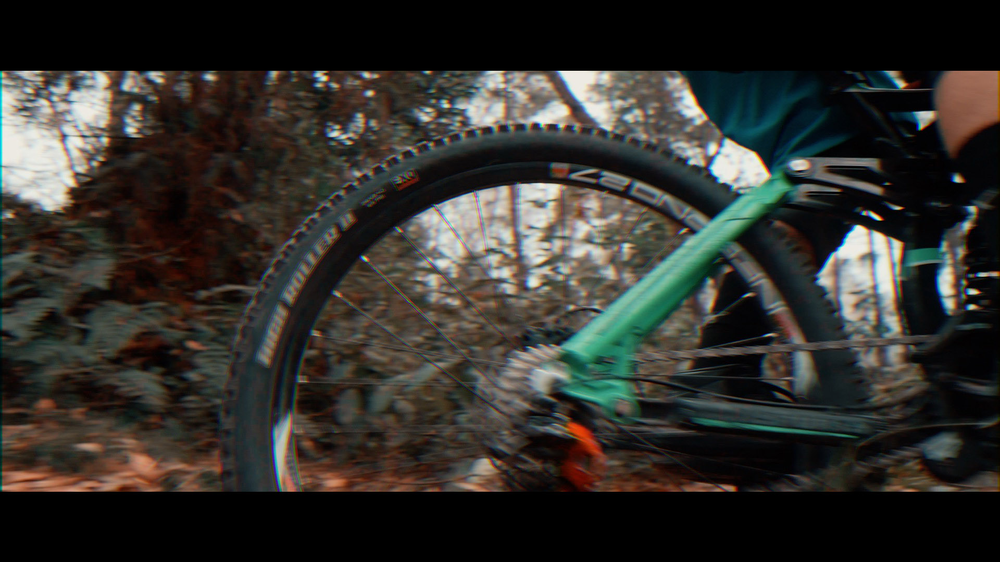
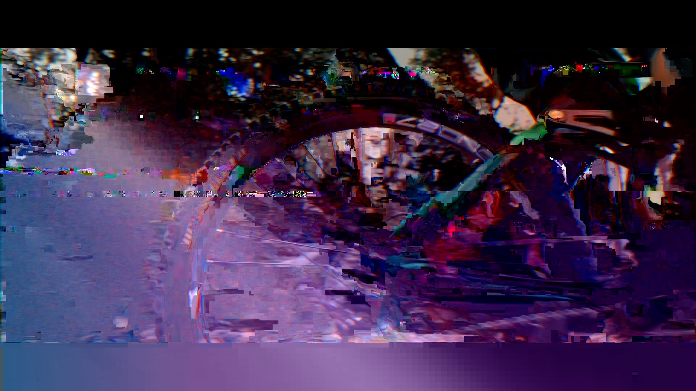
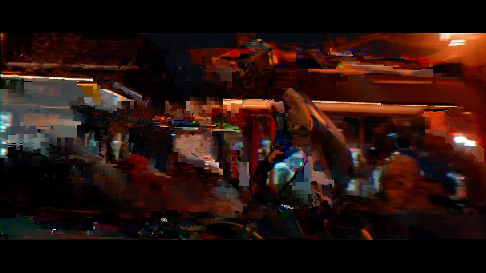
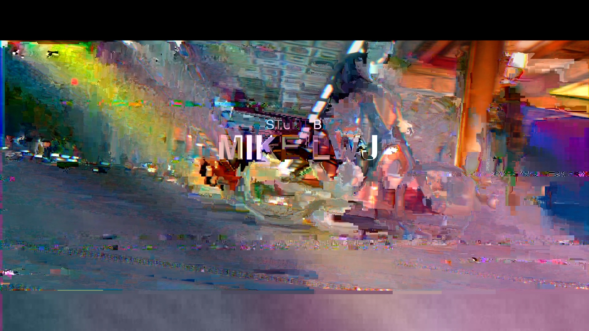

PY_GLITCH 为了艺术而破坏
=========


```
$ python py_glitch.py foler/我的视频.mp4

py_glich.py [-h] [--intensity INTENSITY] [--buffer BUFFERSIZE]
                   [--count COUNT] [--header HEADERSIZE]
                   input [output [output ...]]
  input                 源文件的路径
  output                输出文件夹的路径，默认为源文件所在文件夹

可选参数:
  -h           显示帮助信息
  --intensity  强度，默认为0.1
  --buffer     一次性随机的数据的大小，buffer越大，速度越快，图片适合10以下，视频适合使用100以上;buffer越大，速度越快，glitch越不明显
  --count      生成多少个文件
  --header     文件头部信息的大小，默认200，图片的header一般很小；破坏header将导致文件无法识别

```
一次性生成3个文件，并将intensity强度调低
```
$ python py_glitch.py foler/我的视频.mp4 /目标/文件夹 --count 3 --intensity 0.02
```
### 效果








